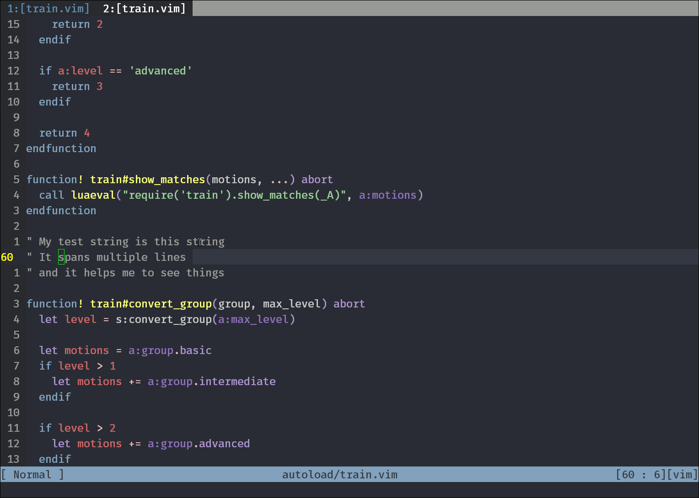

# train.nvim

Train yourself with vim motions and make your own train tracks :)




# Installation

Tested on nvim-0.4.3+

Does not work on Vim, due to incompatible floating window APIs.

```vim
Plug 'tjdevries/train.nvim'
```

# Built-in Commands

```vim
" Train for movements up and down
:TrainUpDown

" Train for movements related to words
:TrainWord

" Train for movements related to text objects
:TrainTextObj
```

## Still Under Construction :smile:

TODO:
- Allow to "cycle through" the options that we've done, in the case of long reaaching movements
- Add more "styles" of movement, and then map them to something like:
  - `<Plug>(train_up_down)`
  - `<Plug>(train_left_right)`
  - `<Plug>(train_word)`
  - etc...
- Add a menu/denite/unite source for "options" of learning movement
- Add visual mode type support? Something similar to MatchParen style
- Add some movements from popular plugins?
- Write a good readme :star2:
